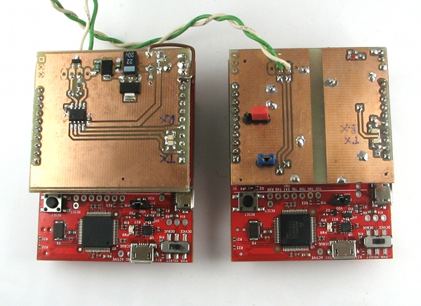
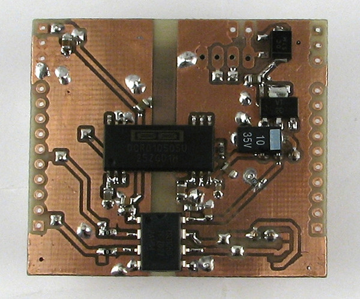

can-boosterpack
===============

A couple of CAN bus boosterpacks for TI Stellaris LaunchPad.

canbus_boosterpack-mcp2551 is a simple CAN bus interface based on MCP2551. It can be used as a basis for a Stellaris Launchpad based CAN bus device. Power source is selectable by a jumper - it can be powered from Vbus on the Launchpad or by external power source that is regulated down to +5V.

canbus_boosterpack-iso1050 is an isolated CAN bus interface based on ISO1050. It is ment to act as an interface between a computer and CAN bus.

These designs are developed with DIY PCB manufactiring in head - they can be produced by standard toner transfer technique for doublesided boards.

A simple CAN bus sniffer firmware developement is in underway.
